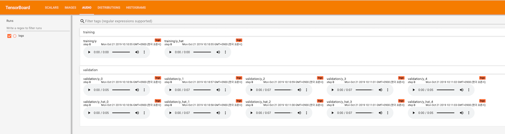
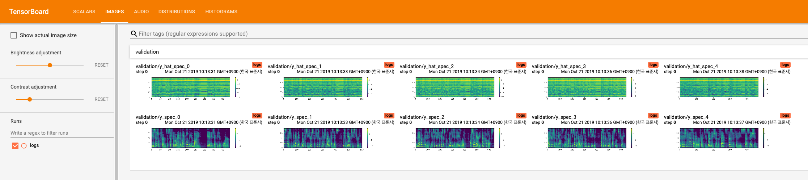

# MelGAN Multi GPU Implementation.

PyTorch implementation of [MelGAN: Generative Adversarial Networks for
Conditional Waveform Synthesis](https://arxiv.org/pdf/1910.06711.pdf).

This implementation includes **distributed** support and uses the 
[LJSpeech dataset](https://keithito.com/LJ-Speech-Dataset/).

## Pre-requisites
1. NVIDIA GPU + CUDA cuDNN
2. Python >= 3.5
3. PyTorch == 1.2
4. Clone this repository.
5. Install python requirements. Please refer [requirements.txt](requirements.txt)

## Dataset
1. Download and extract the [LJ Speech dataset](https://keithito.com/LJ-Speech-Dataset/)
2. Move all wav files to `data/LJSpeech-1.1/wavs`

## Training
1. `python train.py --config=config.json --cps=cp_melgan`

Default checkpoint directory is `cp_melgan`

Tensorboard logs will be saved in `cp_melgan/logs`

## Multi-GPU (distributed) Training
1. `python distributed.py --config=config.json --args_str="--cps=cp_melgan"`

Training code detects all GPUs and sets them automatically. 

## Generated Sample Audio
1. Current Samples (489K Steps)

    [Samples](https://diver-j.github.io/)

2. Sample audio can be heard on the tensorboard also.

3. Generated spectrograme can be seen on the tensorboard.

## Pre-trained model
Coming soon..

## Inference
I will commit a full inference code soon.

## Acknowledgements
- [distributed.py](distributed.py) from NVIDIA's
[waveglow](https://github.com/NVIDIA/waveglow).

I referred to [waveglow](https://github.com/NVIDIA/waveglow) 
to implement audio preprocessing.

